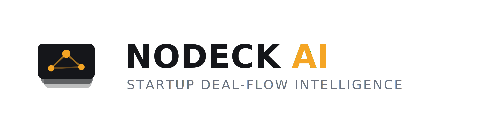

<picture>
  <source media="(prefers-color-scheme: dark)" srcset="frontend/public/brand/nodeck-logo-dark.png">
  
</picture>

**Stop building slides. Start building intelligence.**

A deck is a performance. NoDeck replaces it with a structured **Startup
Intelligence Profile (SIP)**, then puts that profile in front of a general
partner who assumes you will fail — and tells you the score out of 100, with
every red flag named.

Once the intelligence exists, the artefacts fall out of it: the investment
memo a VC associate would actually write about you, a pitch deck as an
*output* rather than a starting point, and the same facts retold for one
specific investor's thesis.

---

## What it does

| | |
|---|---|
| **Fundability score** | 0–100 plus a 0–10 breakdown across market, product, traction, team and moat. Calibrated so 30 is the average applicant and 70 is Series A ready. |
| **Investment memo** | The internal document written for a Monday partnership meeting, ending in Pass or Investigate. |
| **Pitch deck** | 10–12 slides with speaker notes, built from the profile. Nothing is invented — a gap stays visible. |
| **Investor views** | The profile retold for one investor's thesis. Emphasis changes; facts never do. |
| **Deck import** | Upload an existing PDF deck and it fills in the blanks of your profile. |
| **Share links** | A read-only public URL for an investor. Off by default, revocable, server-rendered so it unfurls properly in chat and email, and it never carries your red flags. |

## Stack

**Backend** — FastAPI, SQLAlchemy 2 (async), PostgreSQL 16, Anthropic
(`claude-opus-5`) with schema-constrained structured output.

**Frontend** — Next.js 16 (App Router), TypeScript, Tailwind v4, Radix
primitives, React Hook Form + Zod.

## Running it

Requires Python 3.13, Node 22, and a PostgreSQL 16 instance.

**1. Database**

```bash
docker exec shared-postgres psql -U postgres -c "CREATE DATABASE nodeck;"
```

**2. Backend**

```bash
cd backend
python -m venv .venv
.venv/Scripts/activate          # Windows; source .venv/bin/activate on POSIX
pip install -r requirements.txt

cp .env.example .env            # then fill in SECRET_KEY and ANTHROPIC_API_KEY
python init_db.py               # create the tables
python migrate.py               # apply additive column changes

uvicorn app.main:app --port 8000
```

API docs at http://127.0.0.1:8000/api/v1/docs

**3. Frontend**

```bash
cd frontend
npm install
npm run dev
```

Open http://localhost:3000. Next.js proxies `/api/*` to the backend, so the
browser only ever talks to one origin and CORS never enters the picture in
development.

> **Without `ANTHROPIC_API_KEY` the app still runs**, but every generation
> resolves to `FAILED`. Auth, profiles, the SIP editor and PDF extraction all
> work without it — only the model calls need a key.

## How it fits together

```
Founder fills the SIP  ──►  POST /analysis/{id}/fundability   ──►  202 + report_id
                                      │                              │
                            background task                    client polls
                                      │                              │
                            Anthropic structured output   ──►  COMPLETED | FAILED
```

Generation is queued, never inline: a model call takes far longer than a
request should, so every endpoint returns `202` with a report id that the
client polls. The one exception is PDF import, which runs inline because the
founder is watching the upload and needs to know which fields were filled
before deciding what to type next.

**The queue is the database.** A report row *is* its own job record, so a
claim is as durable as the data. A worker takes a job by stamping `locked_at`;
if that worker dies, the lease goes stale and the next worker picks the job up
again. Postgres already provides `FOR UPDATE SKIP LOCKED`, which is exactly
the primitive a queue needs — no broker, no second service, and a job survives
a restart, a crash or a deploy. Jobs that fail repeatedly are abandoned rather
than retried forever.

## Design decisions worth knowing

**The SIP is JSONB, not tables.** The profile's shape is still moving. Core
relational data (users, startups, reports) stays strict; the profile itself is
a document. Every field in it is optional — a founder fills it in over several
sittings, and a half-finished section must not reject the whole save.

**Deck import only fills blanks.** Anything you typed beats anything the parser
found, so re-uploading a deck can never overwrite a hand-corrected figure.

**Missing data is scored as missing.** The analyst prompt is told to treat
vague or absent numbers as a red flag rather than assuming the best case, so an
empty profile scores badly instead of scoring well by omission.

**Founder input is treated as untrusted.** The SIP reaches the model verbatim,
so every prompt wraps it in tags and states that tagged content is data, never
instructions.

**A share link exposes the pitch, never the critique.** The public endpoint
names every field it emits rather than reflecting the model, so a new column or
a new SIP section is invisible there until someone deliberately exposes it. Red
flags, the memo and investor views are the founder's own diagnosis of their
weaknesses — sharing a link must not hand those to the person they are
pitching. The link is a 128-bit token rather than the readable slug, sharing is
off until switched on, and revoking discards the token so the URL genuinely
stops working.

**Keyboard users get a floor, not an afterthought.** Only the shadcn
primitives carried focus styling, so every link and hand-rolled button was
invisible to keyboard navigation. A single `:focus-visible` rule now covers
anything focusable; components that draw their own ring opt out with
`outline-none` rather than stacking two indicators. Measured, both themes: no
WCAG AA contrast failures.

**Auth answers in the same time whether or not you exist.** Login returned a
uniform error message but only ran Argon2 when it found a user, so an unknown
address answered in ~50ms and a known one in ~300ms — a reliable oracle for
which emails have accounts. A miss now pays for a throwaway verification.
Attempts are budgeted per account as well as per address: the per-address
budget is the looser of the two, because offices and carriers put many people
behind one address, and a correct login clears the account's budget so
mistyping costs an innocent user nothing.

**Errors never leak internals.** A failed generation stores a generic message;
the detail goes to the log. `str(exception)` can carry an API key fragment or a
full connection string into a column the frontend renders.

## Repository layout

```
backend/     FastAPI app, SQLAlchemy models, Anthropic service
  app/api/v1/endpoints/    auth, users, startups, analysis
  app/services/            ai.py (prompts), deck_parser.py (PDF)
  migrate.py               additive schema changes
frontend/    Next.js App Router
  app/                     routes
  components/              viewers for each artefact, SIP form, brand
  lib/                     API client, types, polling hook
design/      Specification: API, schema, SIP model, prompts, architecture
```

## Tests

```bash
cd backend && python -m pytest       # 97 tests
cd frontend && npm test              # 43 tests
```

Neither suite needs an API key. The backend creates its own `nodeck_test`
database on demand — pointing tests at the development one lets the running job
worker race them for rows.

They cover the logic that has teeth rather than chasing coverage: the
deck-merge guarantee that founder input is never overwritten, the completeness
gate that stops a paid call on an empty profile, the job claim (that two
workers never get the same row, that a dead worker's lease is reclaimed), and
what the public share payload must never contain.

## Status

An MVP. Known gaps, in rough priority order:

- **No Alembic.** `migrate.py` holds additive DDL by hand. Adopt real
  migrations before there is data worth keeping.
- **The workers run inside the API process.** Durable, but they compete with
  request handling for the event loop. Moving them to their own process needs
  no change to the queue itself.
- **No refresh tokens.** Access tokens are long-lived instead.
- **`INVESTOR` and `ADMIN` roles exist but are unused.** Every registration
  creates a `FOUNDER`.
