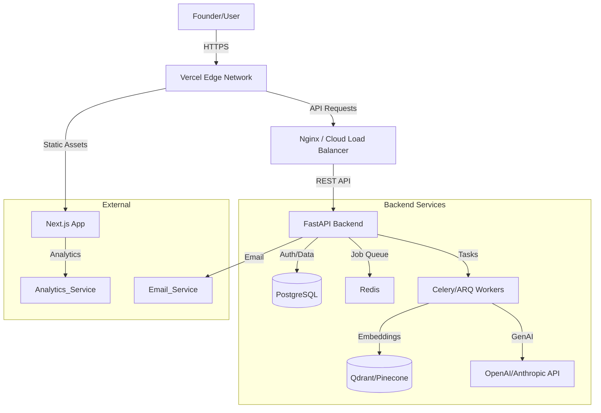

# NoDeck System Architecture

## 1. High-Level Architecture

NoDeck follows a modern, decoupled Monolith-first approach (Modular Monolith) to ensure development velocity while allowing for future scaling.

## 2. Tech Stack

### Frontend
- **Framework**: Next.js 14+ (App Router)
- **Language**: TypeScript
- **Styling**: TailwindCSS (Utility-first, minimal custom CSS)
- **State Management**: React Query (Server state), Zustand (Client state)
- **Forms**: React Hook Form + Zod
- **UI Components**: Radix UI primitives + Custom VC-grade minimalist styling (Shadcn/UI compatible)

### Backend
- **Framework**: FastAPI (Python 3.10+)
- **ORM**: SQLAlchemy 2.0 (Async) + Pydantic v2
- **Database**: PostgreSQL 16
- **Migrations**: Alembic
- **Async Tasks**: Celery (with Redis) or ARQ
- **Auth**: Python-Jose (JWT), Passlib (Argon2 hashing)

### AI & Data
- **LLM Interface**: Instructor / OpenAI SDK (Structured outputs)
- **Models**:
    - *Intelligence/Reasoning*: GPT-4o or Claude 3.5 Sonnet
    - *Fast Tasks*: GPT-3.5-Turbo or Claude 3 Haiku
- **Embeddings**: OpenAI `text-embedding-3-small` or `cohere-embed-v3`
- **Vector DB**: Qdrant (Dockerized for local/MVP)

## 3. Security Architecture

- **Authentication**: Stateless JWTs with short expiry (15m) + Refresh Tokens (HttpOnly cookies).
- **Authorization**: Role-Based Access Control (RBAC) via dependencies in FastAPI.
    - Roles: `FOUNDER`, `INVESTOR`, `ADMIN`
- **Data Protection**:
    - Review of all generated content before persistence (optional filtering).
    - Database encryption at rest (AWS RDS / Cloud standards).
    - TLS 1.3 for all transit.
- **LLM Security**:
    - Prompt Injection defenses (delimiter usage, output validation).
    - PII scrubbing before sending to LLM (if heavily required, mostly strict inputs for MVP).

## 4. Scalability Strategy

- **Stateless Backend**: The FastAPI app is stateless; can scale horizontally behind a load balancer.
- **Async Workers**: Heavy lifting (generating memos, parsing decks) is offloaded to worker queues. This prevents API timeouts and allows independent scaling of worker nodes.
- **Database**: PostgreSQL can scale vertically significantly (millions of rows). Read replicas can be added later.
- **Caching**: Redis used for session storage (if needed) and expensive query caching (e.g., dashboard aggregates).
