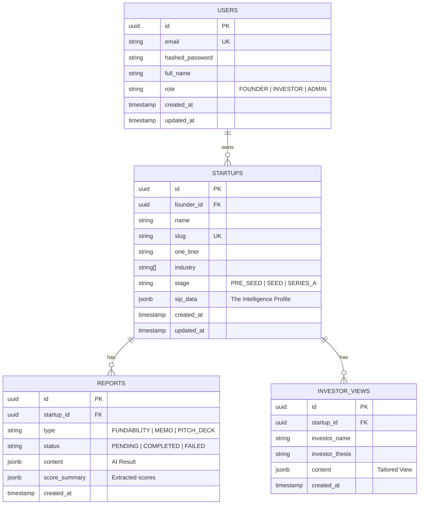

# NoDeck Database Schema

## Overview
We use PostgreSQL as the primary data store.
Key design decision: usage of `JSONB` for the Startup Intelligence Profile (SIP) to allow flexibility in the data structure as the product evolves, while keeping core relational data (Users, IDs, relationships) strict.

## ER Diagram


## JSON Structures

### Startup Intelligence Profile (sip_data)
```json
{
  "identity": {
    "website": "https://...",
    "location": "San Francisco, CA",
    "founded_year": 2024
  },
  "problem": {
    "description": "...",
    "pain_points": ["Cost", "Speed"],
    "current_solutions": "Excel"
  },
  "solution": {
    "product_name": "NoDeck",
    "description": "...",
    "features": ["AI Scoring", "Memo Gen"],
    "tech_stack": ["AI", "Python"]
  },
  "market": {
    "total_addressable_market": 1000000000,
    "serviceable_obtainable_market": 50000000,
    "target_persona": "Founders"
  },
  "traction": {
    "stage": "MVP",
    "metrics": {
      "mau": 100,
      "mrr": 0
    }
  },
  "team": [
    {
      "name": "Jane Doe",
      "role": "CEO",
      "background": "Ex-Google"
    }
  ],
  "fundraising": {
    "ask": 500000,
    "valuation_cap": 5000000
  }
}
```
